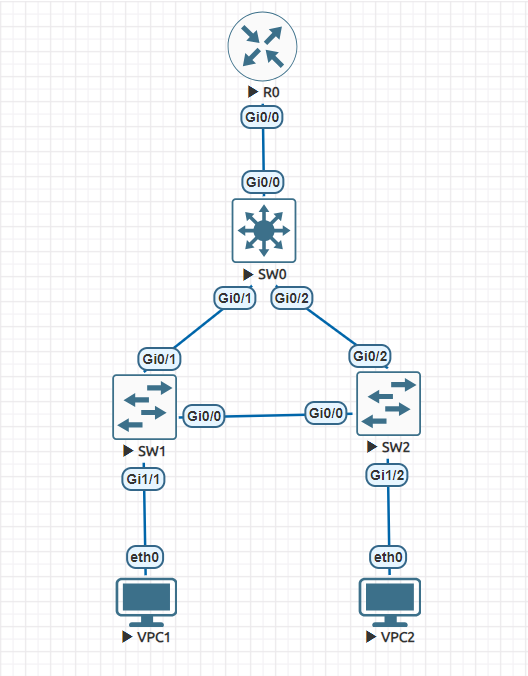

## Топология



## Конфигурация

### VPC1

```
set pcname VPC1
ip 10.10.10.1/24 10.10.10.253
write memory
```
### VPC2

```
set pcname VPC2
ip 10.10.20.1/24 10.10.20.254
write memory
```
### R0
```
enable
configure terminal
    hostname R0
    interface gi0/0
        no ip address
        no shutdown
        exit
    interface gi0/0.10
        encapsulation dot1Q 10
        ip address 10.10.10.253 255.255.255.0
        exit
    interface gi0/0.20
        encapsulation dot1Q 20
        ip address 10.10.20.254 255.255.255.0
        exit
    exit
write memory
```
### SW0
```
enable
configure terminal
    hostname SW0
    spanning-tree mode rapid-pvst
    spanning-tree vlan 10 root primary
    spanning-tree vlan 20 root primary
    vlan 10
        name VLAN10
        exit
    vlan 20
        name VLAN20
        exit
    interface gi0/0
        switchport trunk encapsulation dot1q
        switchport mode trunk
        switchport trunk allowed vlan 10,20
        exit
    interface gi0/1
        switchport trunk encapsulation dot1q
        switchport mode trunk
        switchport trunk allowed vlan 10,20
        exit
    interface gi0/2
        switchport trunk encapsulation dot1q
        switchport mode trunk
        switchport trunk allowed vlan 10,20
        exit
    exit
write memory
```
### SW1
```
enable
configure terminal
    hostname SW1
    spanning-tree mode rapid-pvst
    vlan 10
        name VLAN10
        exit
    interface gi0/1
        switchport trunk encapsulation dot1q
        switchport mode trunk
        switchport trunk allowed vlan 10,20
        exit
    interface gi0/0
        switchport trunk encapsulation dot1q
        switchport mode trunk
        switchport trunk allowed vlan 10,20
        exit
    interface gi1/1
        switchport mode access
        switchport access vlan 10
        exit
    exit
write memory
```
### SW2
```
enable
configure terminal
    hostname SW2
    spanning-tree mode rapid-pvst
    vlan 20
        name VLAN20
        exit
    interface gi0/2
        switchport trunk encapsulation dot1q
        switchport mode trunk
        switchport trunk allowed vlan 10,20
        exit
    interface gi0/0
        switchport trunk encapsulation dot1q
        switchport mode trunk
        switchport trunk allowed vlan 10,20
        exit
    interface gi1/2
        switchport mode access
        switchport access vlan 20
        exit
    exit
write memory
```
## Тестирование
```
VPC1> ping 10.10.20.254 -c 1

84 bytes from 10.10.20.254 icmp_seq=1 ttl=255 time=9.175 ms
```
```
VPC2> ping 10.10.10.253 -c 1

84 bytes from 10.10.10.253 icmp_seq=1 ttl=255 time=7.070 ms
```
Теперь убираем связь между SW1 и SW2:
```
VPC1> ping 10.10.20.254 -c 1

84 bytes from 10.10.20.254 icmp_seq=1 ttl=255 time=10.253 ms
```
```
VPC2> ping 10.10.10.253 -c 1

84 bytes from 10.10.10.253 icmp_seq=1 ttl=255 time=8.421 ms
```
Как видим, пинги все еще доходят от одного клиента до другого.